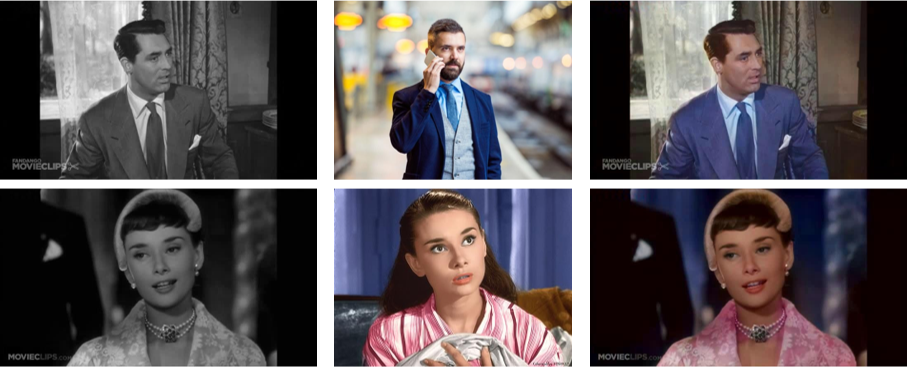
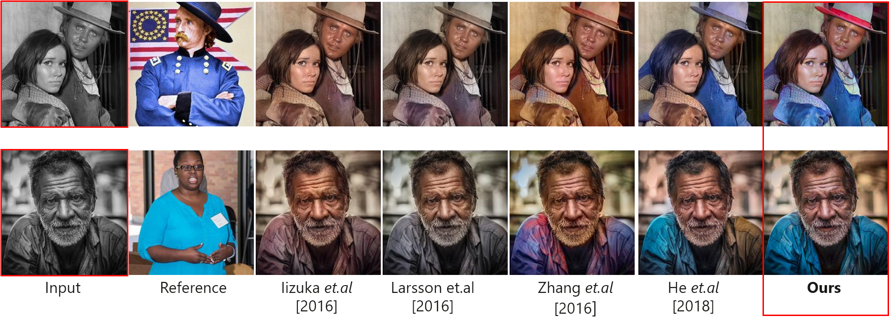
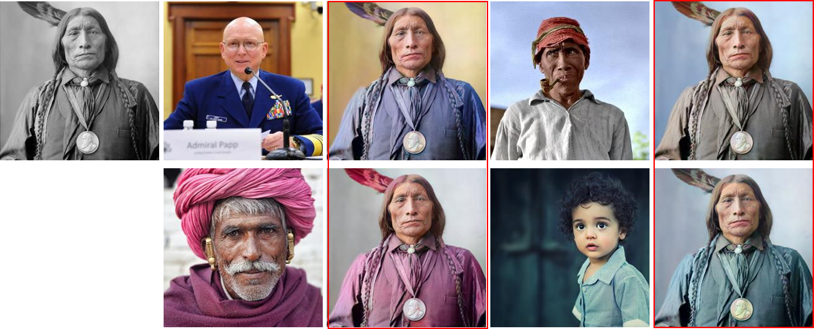
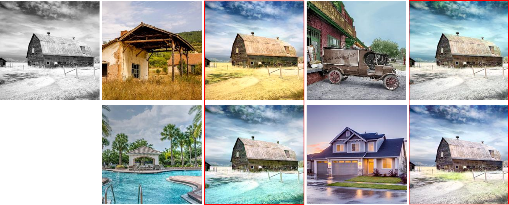

# Deep Exemplar-based Video Colorization (Pytorch Implementation)



### [Paper](https://arxiv.org/abs/1906.09909) | [Pretrained Model](https://facevc.blob.core.windows.net/zhanbo/old_photo/colorization_checkpoint.zip) | [Youtube video](https://youtu.be/HXWR5h5vVYI) :fire: | [Colab demo](https://colab.research.google.com/drive/1Y1XTlTdUG-2LzrH1Vnr_osg9BQavfYsz?usp=sharing)

**Deep Exemplar-based Video Colorization, CVPR2019**

[Bo Zhang](https://www.microsoft.com/en-us/research/people/zhanbo/)<sup>1,3</sup>,
[Mingming He](http://mingminghe.com/)<sup>1,5</sup>,
[Jing Liao](https://liaojing.github.io/html/)<sup>2</sup>,
[Pedro V. Sander](https://www.cse.ust.hk/~psander/)<sup>1</sup>,
[Lu Yuan](https://www.microsoft.com/en-us/research/people/luyuan/)<sup>4</sup>,
[Amine Bermak](https://eebermak.home.ece.ust.hk/)<sup>1</sup>,
[Dong Chen](https://www.microsoft.com/en-us/research/people/doch/)<sup>3</sup> <br>
<sup>1</sup>Hong Kong University of Science and Technology,<sup>2</sup>City University of Hong Kong,
<sup>3</sup>Microsoft Research Asia, <sup>4</sup>Microsoft Cloud&AI, <sup>5</sup>USC Institute for Creative Technologies

<!--  -->

## Prerequisites

- Python 3.6+
- Nvidia GPU + CUDA, CuDNN

## Installation

First use the following commands to prepare the environment:

```bash
conda create -n ColorVid python=3.6
source activate ColorVid
pip install -r requirements.txt
```

Then, download the pretrained models from [this link](https://github.com/zhangmozhe/Deep-Exemplar-based-Video-Colorization/releases/download/v1.0/colorization_checkpoint.zip), unzip the file and place the files into the corresponding folders:

- `video_moredata_l1` under the `checkpoints` folder
- `vgg19_conv.pth` and `vgg19_gray.pth` under the `data` folder

## Data Preparation

In order to colorize your own video, it requires to extract the video frames, and provide a reference image as an example.

- Place your video frames into one folder, _e.g._, `./sample_videos/v32_180`
- Place your reference images into another folder, _e.g._, `./sample_videos/v32`

If you want to _automatically_ retrieve color images, you can try the retrieval algorithm from [this link](https://github.com/hmmlillian/Gray-Image-Retrieval) which will retrieve similar images from the ImageNet dataset. Or you can try [this link](https://github.com/pochih/CBIR) on your own image database.

## Test

```bash
python test.py --image-size [image-size] \
               --clip_path [path-to-video-frames] \
               --ref_path [path-to-reference] \
               --output_path [path-to-output]
```

We provide several sample video clips with corresponding references. For example, one can colorize one sample legacy video using:

```bash
python test.py --clip_path ./sample_videos/clips/v32 \
               --ref_path ./sample_videos/ref/v32 \
               --output_path ./sample_videos/output
```

Note that we use 216\*384 images for training, which has aspect ratio of 1:2. During inference, we scale the input to this size and then rescale the output back to the original size.

## Train

We also provide training code for reference. The training can be started by running:

```bash
python train.py --data_root [root of video samples] \
       --data_root_imagenet [root of image samples] \
       --gpu_ids [gpu ids] \
```

We do not provide the full video dataset due to the copyright issue. For image samples, we retrieve semantically similar images from ImageNet using [this repository](https://github.com/hmmlillian/Gray-Image-Retrieval). Still, one can refer to our code to understand the detailed procedure of augmenting the image dataset to mimic the video frames.

## Comparison with State-of-the-Arts

<figure>

</figure>

## More results

<figure>

</figure>

<figure>

</figure>

:star: Please check our [Youtube demo](https://youtu.be/HXWR5h5vVYI) for results of video colorization.

## Citation

If you use this code for your research, please cite our paper.

```
@inproceedings{zhang2019deep,
title={Deep exemplar-based video colorization},
author={Zhang, Bo and He, Mingming and Liao, Jing and Sander, Pedro V and Yuan, Lu and Bermak, Amine and Chen, Dong},
booktitle={Proceedings of the IEEE Conference on Computer Vision and Pattern Recognition},
pages={8052--8061},
year={2019}
}
```

## Old Photo Restoration :fire:

If you are also interested in restoring the artifacts in the legacy photo, please check our recent work, [bringing old photo back to life](https://github.com/microsoft/Bringing-Old-Photos-Back-to-Life).

```
@inproceedings{wan2020bringing,
title={Bringing Old Photos Back to Life},
author={Wan, Ziyu and Zhang, Bo and Chen, Dongdong and Zhang, Pan and Chen, Dong and Liao, Jing and Wen, Fang},
booktitle={Proceedings of the IEEE/CVF Conference on Computer Vision and Pattern Recognition},
pages={2747--2757},
year={2020}
}
```

## License

This project is licensed under the MIT license.
